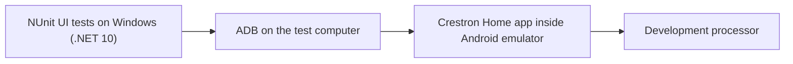

# Set up an Android emulator for Crestron Home UI tests

This guide sets up a Windows computer to test the **real Crestron Home Android app** with the **Crestron Home NUnit UI automation library**. It covers the emulator, installing the app inside it, connecting to a processor, and adding the NUnit sample to your development workflow.

This is useful for ordinary driver development. It does not require or initiate a submission to Crestron. Client and library projects can continue using desktop and processor tests without any emulator.

## Contents

- [What runs where](#what-runs-where)
- [Choose an emulator](#choose-an-emulator)
- [Install and start Google Android Emulator](#install-and-start-google-android-emulator)
- [Install and start BlueStacks](#install-and-start-bluestacks)
- [Install the Crestron Home app inside the emulator](#install-the-crestron-home-app-inside-the-emulator)
- [Enable and check ADB](#enable-and-check-adb)
- [Check and update the Crestron Home app](#check-and-update-the-crestron-home-app)
- [Create your private Android profile](#create-your-private-android-profile)
- [Add the sample NUnit project](#add-the-sample-nunit-project)
- [Run the first complete workflow](#run-the-first-complete-workflow)
- [Daily use and CI](#daily-use-and-ci)
- [Troubleshooting](#troubleshooting)

## What runs where

**Google Android Emulator** and **BlueStacks** both run Android apps on a Windows computer. Google's emulator is available through Visual Studio's Android tools or Android Studio; BlueStacks is a separate app player. Either supplies the Android device for these tests. **ADB**, Android Debug Bridge, is the connection our test code uses to inspect that device and send UI inputs.

The NUnit tests run on Windows with .NET 10. The Crestron Home app runs inside Android and communicates with your processor. No NUnit assembly is installed in Android.



You need an existing working [processor development workflow](ContinuousIntegration.md), its private credentials and certificate fingerprints, and an actual driver target. The optional Android stage runs after the driver update and installed-driver checks. The generic starter checks Home navigation; each driver needs its own control assertions.

## Choose an emulator

| Choice | Current position in this project |
| --- | --- |
| **Google Android Emulator**, available through Visual Studio or Android Studio | A Debug workflow passed with an Android 16 virtual device minimized. Inspection fixtures also passed from the Windows GitHub runner service against that existing emulator. |
| **BlueStacks 5, Pie 64-bit** | A complete development workflow passed with the app running minimized in a logged-in Windows session. |

Choose one emulator and follow its installation section below. BlueStacks is not required for Google's emulator. Both use the shared app-installation, processor-connection and NUnit instructions that follow.

Microsoft's [.NET Android emulator documentation](https://learn.microsoft.com/en-us/dotnet/maui/android/emulator/?view=net-maui-10.0) describes Google's emulator integrated with Visual Studio. Our test library uses ordinary ADB and an explicit device serial, so it is not tied to BlueStacks or to a MAUI application.

## Install and start Google Android Emulator

### Through Visual Studio

The emulator download is managed in the **Android SDK Manager inside Visual Studio**, rather than by searching the Visual Studio Installer's individual components.

1. In Visual Studio itself, open **Tools > Android > Android SDK Manager**.
2. On its **Tools** tab, select **Android Emulator** and **Android SDK Platform-Tools** and apply the installation. Record the SDK location shown by the manager; its `platform-tools/adb.exe` is used below.
3. Open **Tools > Android > Android Device Manager**, create a virtual device, and start it. Include **Google Play Store** only if you want to install through the store; direct APK installation does not require Google sign-in.
4. Follow the app installation and processor connection steps below inside that virtual device.

If the Android menus are missing, use Visual Studio Installer to add the **.NET Multi-platform App UI development** workload first. Microsoft documents the SDK requirements and Device Manager in [managing virtual devices](https://learn.microsoft.com/en-us/dotnet/maui/android/emulator/device-manager?view=net-maui-10.0). The workload provides development tools; our UI fixtures remain ordinary Windows NUnit tests and do not require writing a MAUI app.

Use **Windows Hypervisor Platform (WHPX)** for acceleration on a compatible Windows computer. The separate **Android Emulator Hypervisor Driver** offered under SDK Manager's Extras is an alternative that requires Hyper-V to be off, so do not install it alongside an active Windows hypervisor. Once the emulator is installed, its `emulator.exe -accel-check` command reports whether acceleration is usable. See [Microsoft's acceleration guide](https://learn.microsoft.com/en-us/dotnet/maui/android/emulator/hardware-acceleration?view=net-maui-10.0) before changing Windows features; an enabled feature may require a computer restart.

### Through Android Studio

Install [Android Studio](https://developer.android.com/studio), use its SDK Manager to install **Android Emulator** and **Android SDK Platform-Tools**, then open **Device Manager** and create and start a virtual device. Record the SDK location for the ADB commands below. Google's [virtual-device guide](https://developer.android.com/studio/run/managing-avds) describes hardware profiles and system images.

### Choose an image and finish Android setup

Select an Android version and CPU architecture compatible with your Crestron Home APK. The validated Google setup used a Pixel 7 profile with Android 16. Keep language, orientation and display configuration consistent between runs; the supplied navigation sample expects English app labels.

If you want Play Store installation, choose a device/system image that includes **Google Play Store**. A **Google APIs** image includes Google services but is not necessarily a Play Store image. For direct APK installation, skip Google sign-in: **a Google account is not required**. The selected image must still provide the app's runtime dependencies.

Wait for Android to finish booting, then continue with [installing Crestron Home](#install-the-crestron-home-app-inside-the-emulator). Creating a virtual device does not install the Crestron app or copy connections from another emulator.

## Install and start BlueStacks

1. Download **BlueStacks 5 App Player** from the [official installation page](https://support.bluestacks.com/hc/en-us/articles/360061525271-How-to-download-and-install-BlueStacks-5). Install it on the Windows computer that will execute the UI tests.
2. Check the vendor's [Windows and Hyper-V requirements](https://support.bluestacks.com/hc/en-us/articles/4415238471053-System-requirements-for-BlueStacks-5-on-Hyper-V-enabled-Windows-10-and-11). Follow the installer path appropriate to your Windows configuration. This guide does not require disabling Windows security features.
3. Open **Multi-instance Manager**, create a **Fresh instance**, and select **Pie 64-bit**. Download the image if requested, then start that instance. See the [vendor's illustrated Pie setup](https://support.bluestacks.com/hc/en-us/articles/4407503795341-How-to-play-games-using-a-Pie-64-bit-instance-on-BlueStacks-5).
4. Give this instance a recognizable development name. Keep its language and display configuration consistent between test runs. The supplied Crestron navigation sample currently expects English app labels.

An emulator instance has its own installed apps and saved settings. Creating another instance does not automatically configure it for Crestron Home testing.

## Install the Crestron Home app inside the emulator

Installing either emulator is only the first part of setup. **You must also install the Crestron Home Android app inside the specific Google virtual device or BlueStacks instance that will run your tests.** Apps and saved connections are not shared between instances.

Choose an installation route:

- **Google Play, if your emulator image includes it:** open Play Store inside the emulator, sign in with a Google account, search for **Crestron Home**, verify the Crestron publisher against the [official listing](https://play.google.com/store/apps/details?id=com.crestron.phoenix.app), and install it.
- **Direct APK installation, without a Google account:** use a legitimate Crestron-supplied installer or the original signed APK from your own existing installation. Enable ADB as described below, then run `adb -s TARGET_SERIAL install PATH_TO_APK`. If the existing app is split across several APKs, all required splits must be retained and installed together with `install-multiple`. Do not assume that one extracted base APK is sufficient. Android documents [APK installation through ADB](https://developer.android.com/tools/adb#move). Keep the installer private; this project does not redistribute the Crestron app.

For example, after [checking ADB](#enable-and-check-adb), install a single APK on Google's emulator from PowerShell:

```powershell
$adb = 'C:/Android/Sdk/platform-tools/adb.exe' # Replace with your SDK location.
$serial = 'emulator-5554' # Replace with the exact serial from adb devices.
& $adb -s $serial install 'C:/Private/Android/CrestronHome.apk'
```

The same command works for BlueStacks after connecting to its ADB endpoint and substituting its serial. For a split installation, use `install-multiple` followed by the paths of the base APK and every required split. Do not run both installation commands for the same installer.

For transfer from another Android instance, `adb -s SOURCE_SERIAL shell pm path com.crestron.phoenix.app` lists the installed APK paths. Copy each listed file to a private Windows directory with `adb -s SOURCE_SERIAL pull REMOTE_PATH LOCAL_PATH`, then install those files on the target. This copies the app, not its saved Home connections or credentials. Verify Android version and CPU compatibility; an APK from one device may not run on another. Google sign-in can be skipped during emulator setup, although the app's own runtime dependencies still need validation.

Copying an app also copies its **existing version**, which may be old. A recent installation date does not prove that the app is current. Check its version and follow the update instructions below before establishing a new test baseline. BlueStacks is not needed to obtain an APK when you already have another legitimate source.

Use the end-user **Crestron Home** app, not Configure Pro or the Setup app. After either installation route:

1. Open Crestron Home inside the emulator. Add your development Home using its actual processor address or hostname. If discovery does not find it, use the manual connection option. An emulator's network behavior can differ from a physical phone.
2. Enter the **User Interface Device Password** configured for that Home when prompted. This is separate from the SSH/admin credentials used by the processor workflow; do not assume they are interchangeable. The [Crestron password documentation](https://docs.crestron.com/en-us/8525/Content/CP4R/Installer-Settings/Sys-Config/System-Info-and-Pass.htm) identifies the UI-device password used to join the system.
3. Record the exact Home display name, saved local address and local UI port. Use your configured port; the example below uses 50001. See [Crestron's user-interface pairing instructions](https://docs.crestron.com/en-us/8525/Content/CP4R/Appendix/Pair-User-Interfaces.htm).
4. Connect and confirm that you can see the correct Home and driver tiles. In **My Systems**, inspect that Home's saved local address and port as well as its name, then return to the same Home. A familiar name alone can conceal a connection to another development processor. Close menus, settings screens and driver panels, leaving the unobstructed **Home** screen visible.

Complete account login, permissions and any first-run dialogs manually. The supplied fixture does not enter passwords or dismiss unknown dialogs. Keep emulator data and saved logins private.

## Enable and check ADB

Use a current **Android SDK Platform-Tools** `adb.exe`. Its location is the SDK directory shown in your SDK Manager, followed by `platform-tools/adb.exe`. Paths and serials below are examples; replace them with your installation's values. Keep ADB local to the test computer.

Run these checks in PowerShell **before any workflow owns the Android session**.

### Google Android Emulator

Start the virtual device from Device Manager. The local emulator registers with ADB automatically; it normally appears with a serial such as `emulator-5554`. There is no BlueStacks ADB setting to enable and no `adb connect` step for this route.

```powershell
$adb = 'C:/Android/Sdk/platform-tools/adb.exe'
& $adb devices
$serial = 'emulator-5554' # Use the exact serial listed above.
& $adb -s $serial shell getprop sys.boot_completed
& $adb -s $serial shell pm path com.crestron.phoenix.app
```

### BlueStacks

Open **Settings > Advanced**, enable **Android Debug Bridge**, and save the change. Record the address shown for that instance; `127.0.0.1:5555` below is only an example. The vendor's [ADB setup instructions](https://support.bluestacks.com/hc/en-us/articles/23925869130381-How-to-enable-Android-Debug-Bridge-on-BlueStacks-5) include screenshots.

```powershell
$adb = 'C:/Android/Sdk/platform-tools/adb.exe'
$serial = '127.0.0.1:5555' # Use this instance's observed endpoint.
& $adb connect $serial
& $adb devices
& $adb -s $serial shell getprop sys.boot_completed
& $adb -s $serial shell pm path com.crestron.phoenix.app
```

BlueStacks also supplies `HD-Adb.exe`, but using the same current SDK client for both emulators avoids conflicts with older bundled clients and the shared ADB server.

### Check either emulator

Check the results:

- `devices` lists that exact serial with state `device`.
- `sys.boot_completed` prints `1`.
- `pm path` returns the installed Crestron Home app's APK path. An empty result means the app is missing from this particular instance.

Always select the device explicitly. Do not let a test choose the first of several connected Android devices. These checks read readiness and app installation; they do not prove that Home is connected to the intended processor. See [Android's ADB documentation](https://developer.android.com/tools/adb) for device selection and connection behavior.

When using BlueStacks alongside Google's emulator, use one current Android SDK `adb.exe` for both. An older BlueStacks ADB client can conflict with the SDK client's shared server. BlueStacks may also move its active ADB port when another emulator occupies the configured port: verify the currently observed endpoint before connecting and update the private profile accordingly. Never restart a shared ADB server while tests own either instance.

## Check and update the Crestron Home app

Stop UI tests before updating their emulator. Preserve any interrupted reservation for reconciliation; do not clear a lock to force an update. Use the same explicitly selected device for every command. These are copyable **PowerShell** commands, not Command Prompt commands.

Read the installed version:

```powershell
$adb = 'C:/Android/Sdk/platform-tools/adb.exe' # Replace with your SDK location.
$serial = 'emulator-5554' # Replace with the intended device from adb devices.
& $adb -s $serial shell dumpsys package com.crestron.phoenix.app |
    Select-String 'versionName=|versionCode='
```

Compare with the current [Crestron Home release on Google Play](https://play.google.com/store/apps/details?id=com.crestron.phoenix.app), rather than the processor's firmware version or an old APK filename. With a Play-enabled image and account, update through Play Store. Without an account, obtain a current original signed APK from Crestron or an independently trusted installation. For a split app, obtain the complete compatible split set.

If you choose a third-party APK mirror, its claimed version, checksum or virus-scan badge is not proof of publisher identity. Independently verify the package as `com.crestron.phoenix.app`, its valid signature and its signer against your known authentic installed copy or a publisher-confirmed certificate. Do not install a mirror's downloader/helper app. For an initial installation without a trusted signing reference, obtain one from Crestron or an authentic installation first.

Install **Android SDK Build-Tools** in SDK Manager to obtain `apksigner.bat` and `aapt.exe`. `apksigner` also needs a working Java installation; use the JDK configured by your Android tools. Replace the Build-Tools version and both private APK paths below with your actual values:

```powershell
$buildTools = 'C:/Android/Sdk/build-tools/36.0.0'
& "$buildTools/apksigner.bat" verify --verbose --print-certs 'C:/Private/Android/KnownAuthentic.apk'
if ($LASTEXITCODE -ne 0) { throw 'The reference APK did not verify.' }
& "$buildTools/apksigner.bat" verify --verbose --print-certs 'C:/Private/Android/CrestronHome-update.apk'
if ($LASTEXITCODE -ne 0) { throw 'The update APK did not verify.' }
& "$buildTools/aapt.exe" dump badging 'C:/Private/Android/CrestronHome-update.apk' |
    Select-String '^package:|^sdkVersion:|^native-code:'
& $adb -s $serial shell getprop ro.build.version.sdk
& $adb -s $serial shell getprop ro.product.cpu.abilist
```

Compare the **Signer certificate SHA-256 digest**, not its display name or the APK file hash. If certificates differ, stop and establish any publisher-authorized signing-key rotation; do not uninstall the trusted app or re-sign an APK to bypass the mismatch. Check that the package version is the intended update, its minimum Android API is supported, and the emulator can execute its native CPU architecture. Google's [apksigner reference](https://developer.android.com/tools/apksigner) explains verification and certificate output.

After verification, update a single-APK installation in place:

```powershell
& $adb -s $serial install -r 'C:/Private/Android/CrestronHome-update.apk'
if ($LASTEXITCODE -ne 0) { throw 'App update failed; inspect the error before retrying.' }
& $adb -s $serial shell dumpsys package com.crestron.phoenix.app |
    Select-String 'versionName=|versionCode='
```

The `-r` option keeps the existing app data. For a split installation, use `install-multiple -r` with the verified complete split set instead. Do not uninstall first or clear app storage: doing so loses saved connections. Retain a private copy of the previous installer and normal emulator backup; an older APK alone does not guarantee rollback of app data migrated by a newer version. See [Android's installation options](https://developer.android.com/tools/adb#move).

Open the updated app, handle any expected first-run prompts, verify its saved processor address/port and connected Home, and run the read-only navigation starter before physical-control fixtures. Record the app version, Android version, emulator image and APK/signing digests with the private test environment. The generic workflow does not currently enforce a pinned app version or automatically update it. Avoid app updates during a UI test run; results and timing comparisons must identify the version actually tested.

An Android app update does not update the processor driver. Whether an endurance run is affected depends on its observation policy: a processor-only probe does not use the Android app, whereas an app-based probe would have a changed test environment. Do not relabel earlier UI results as tests of the new app.

## Create your private Android profile

Create a private directory outside your repository, accessible to the Windows account running the tests. In it, save `android-profile.json`, based on [the profile example](../examples/android-session.example.json). This complete example selects **Google Android Emulator**:

```json
{
  "adbExecutable": "C:/Android/Sdk/platform-tools/adb.exe",
  "deviceSerial": "emulator-5554",
  "application": "com.crestron.phoenix.app",
  "expectedHomeText": "My Development Home",
  "localPort": 50001,
  "lockPath": "C:/CI/Private/Android/worker.lease"
}
```

**For BlueStacks**, use the same profile structure and SDK ADB path, but set `deviceSerial` to its connected endpoint, for example `127.0.0.1:5555`. For either emulator, copy the exact serial from `adb devices`; the friendly virtual-device name is not the ADB serial.

Replace every example value that differs on your computer. `expectedHomeText` must match the visible Home name exactly. `localPort` is the processor's saved UI connection port, **not the ADB port**. The Android lock's parent directory must exist; the workflow creates the lock file itself.

All tools sharing one Android instance must use the same `lockPath`. Keep the profile, processor credentials, live-device settings and captured results outside Git. The Android profile does not contain a processor password; the existing workflow supplies processor access through its separate private settings.

## Add the sample NUnit project

Copy the entire [AndroidWorkflowTests sample folder](../samples/AndroidWorkflowTests) into your driver repository. It is also included in the downloadable documentation archive. Preserve its source notices. Add its `.csproj` to your solution as an existing project.

The sample is self-contained and uses these published packages: `CrestronHomeNUnit.TestAdapter` 1.7.1, `NUnit`, `NUnit3TestAdapter` and `Microsoft.NET.Test.Sdk`. It does not require a second checkout of this repository. `UseSourceAndroid=true` is only for contributors working in the tooling repository.

Keep it separate from your workflow-container project and your net472 processor-test project. Do not add a `Workflows.xml` to the UI project: ordinary NUnit runs its fixtures, while the existing workflow container coordinates the complete cycle.

First check the copied sample without a hardware context:

```powershell
Remove-Item Env:CRESTRON_HOME_ANDROID_CONTEXT -ErrorAction SilentlyContinue
dotnet test ./AndroidWorkflowTests/AndroidWorkflowTests.csproj --list-tests
dotnet test ./AndroidWorkflowTests/AndroidWorkflowTests.csproj
```

Discovery should list the sample tests without opening Android. Ordinary execution should report them as **skipped**, with a message requiring an opted-in processor workflow. That is the expected offline behavior, not a hardware pass.

## Run the first complete workflow

Add this optional section to your existing private **driver workflow plan**, using absolute paths on the worker:

```json
"androidTests": {
  "project": "C:/CI/Source/MyDriver/AndroidWorkflowTests/AndroidWorkflowTests.csproj",
  "profilePath": "C:/CI/Private/Android/android-profile.json"
}
```

The UI project must be inside a declared `sourceRoots` directory. Keep the existing actual-driver target, processor live suites and installed-driver checks. Put the UI project only in `androidTests`, not `localTests`. The coordinator creates the private run context and binds it to the tested package, installed driver and held reservations; do not manufacture or reuse that context yourself.

Start your chosen emulator, connect the app, leave Home visible, and select the complete workflow in [Visual Studio Test Explorer](VisualStudioTestExplorer.md). Alternatively use the [workflow CLI](ProcessorTestWorkflow.md). This runs the configured earlier stages, which can deploy and update the actual driver, before running the Android tests.

The sample verifies Home readiness, reads the saved local endpoint twice and returns to Home. Expect detailed Android TRX results, discovery coverage, screenshots, UI hierarchy captures and restoration evidence in the workflow's private `AndroidUI` results directory. Every discovered UI test must pass. A skipped, missing or failed case blocks that workflow.

This is a connectivity/navigation starter. Extend it with driver-specific assertions before claiming coverage of that driver's controls. A saved Home address and visible name do not independently prove the app's active route or binding to a particular physical device. Physical-control tests require additional target verification and independent state restoration.

## Daily use and CI

Both Google Android Emulator and BlueStacks can remain **minimized** during the validated workflow; the test library does not need the Windows mouse or keyboard. Leave the emulator running and avoid manually using the same Android instance during a test. After tests confirm restoration and release their reservations, you can use or close it normally.

The development workflow has been exercised with an emulator already running in a logged-in Windows session. Read-only fixture execution also passed as NETWORK SERVICE against the existing Google emulator, with capture evidence, restored temporary name and Home, preserved checked state and released reservations. That service run did not deploy a driver or send physical controls. Complete deployment under that account still requires separate validation.

For service-driven tests, interactive and service accounts must use the same accessible Android reservation path and appropriate private configuration/evidence storage. Provision only the required files; do not grant access to an entire personal profile. Starting the emulator from the service, operation after logout/reboot and crash recovery remain separate validation work.

Google documents a `-no-window` launch option in its [emulator command-line guide](https://developer.android.com/studio/run/emulator-commandline#advanced). It has not been validated by this project. Minimized operation and a service using an already-running emulator do not establish unattended emulator startup.

For CI, run the workflow on a trusted machine with access to the processor and private settings. Keep the processor and Android reservations for the complete sequence. Do not erase app data or recreate the emulator for every run: that removes its installed app and connection settings. Plan updates to the emulator and Home app, then rerun readiness and UI checks before relying on the changed environment.

No signature, Crestron submission profile or portal account is required for these development tests. Only a separately enabled driver-submission workflow uses additional certification evidence and delivery steps.

## Troubleshooting

| Symptom | Check |
| --- | --- |
| ADB executable not found | Confirm the installation directory and the full `adbExecutable` path. |
| No device, or `offline` | Start the selected virtual device and wait for Android startup. For BlueStacks, also confirm its ADB setting/address and connect to that endpoint. Do not reset a shared ADB server while another job owns it. |
| More than one Android device | Use the exact `deviceSerial` for the intended instance. |
| Crestron app missing | Install the app in that exact Google virtual device or BlueStacks instance using Play Store or the direct APK route above. Installing an emulator alone does not install Home. |
| APK architecture or Android-version error | Compare the APK's minimum API/native libraries with this virtual device. Use a compatible original APK and image; an x86 device does not necessarily support ARM translation. |
| Update rejected because signatures differ | Preserve the installed app and data. Verify the publisher and any legitimate key rotation; do not uninstall or re-sign to bypass the check. |
| Home cannot connect | Check the actual processor address, configured UI port and UI-device password. Establish a manual connection before testing. |
| Wrong Home or unexpected panel | Select the correct Home manually and close dialogs before starting. The fixture intentionally rejects mismatches. |
| Tests skipped | A direct UI-project run has no workflow context. Run the complete workflow to enable hardware execution. |
| Works on desktop, fails in CI | Check the runner account, existing emulator session, ADB path/serial, shared reservation path and private-file permissions. Service fixture execution against an already-running Google emulator has passed; service startup of the emulator has not. |
| Reservation remains after a failure | Inspect the retained workflow evidence and confirm its process and child commands have stopped. Reconcile UI/device state before following [interrupted-run recovery](ContinuousIntegration.md#cleanup-and-interrupted-runs). Do not simply delete the lock and retry. |

The tested BlueStacks environment used Pie 64-bit and Crestron Home Android 4.6.18. This records the validation environment, not a promise that every app/emulator version behaves identically. A clean-machine installation has not yet been repeated end to end for either emulator.

On 16 September 2026, Crestron Home 4.6.18 was also copied from that BlueStacks instance and installed on a Pixel 7 Android 16 (API 36.1) emulator without Google sign-in. Both read-only sample driver UI cases passed while the emulator was minimized, with return to Home and unchanged gateway state verified. Use the published 1.7.1 adapter, which handles the local-port field being below the portrait viewport. Version 1.7.0 can stop at that field. A prior app termination was observed; reopening restored connectivity, but its cause remains unconfirmed. The emulator's full unattended lifecycle is still separate validation work.

On 19 September 2026, that Google emulator was updated in place to Crestron Home `4.11.1+pr` (version code 13683) without Google sign-in. APK signature verification passed and the signer matched the previously installed app; the saved Home connection opened after the update. This establishes installation and basic reconnection only. The earlier fixture results remain results for 4.6.18; full UI acceptance on 4.11.1 is separate work. These are dated observations, not a permanent assertion that either version is the latest.
