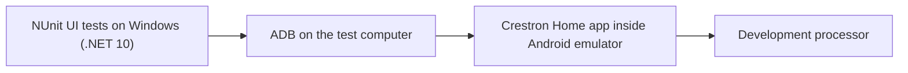

# Set up an Android emulator for Crestron Home UI tests

This guide sets up a Windows computer to test the **real Crestron Home Android app** with the **Crestron Home NUnit UI automation library**. It covers the emulator, installing the app inside it, connecting to a processor, and adding the NUnit sample to your development workflow.

This is useful for ordinary driver development. It does not require or initiate a submission to Crestron. Client and library projects can continue using desktop and processor tests without any emulator.

## Contents

- [What runs where](#what-runs-where)
- [Choose an emulator](#choose-an-emulator)
- [Install and start BlueStacks](#install-and-start-bluestacks)
- [Install the Crestron Home app inside the emulator](#install-the-crestron-home-app-inside-the-emulator)
- [Enable and check ADB](#enable-and-check-adb)
- [Create your private Android profile](#create-your-private-android-profile)
- [Add the sample NUnit project](#add-the-sample-nunit-project)
- [Run the first complete workflow](#run-the-first-complete-workflow)
- [Daily use and CI](#daily-use-and-ci)
- [Troubleshooting](#troubleshooting)

## What runs where

**BlueStacks** is a third-party application that runs Android apps on a Windows computer. Its app player acts as the Android device. **ADB**, Android Debug Bridge, is the connection our test code uses to inspect that device and send UI inputs.

The NUnit tests run on Windows with .NET 10. The Crestron Home app runs inside Android and communicates with your processor. No NUnit assembly is installed in Android.



You need an existing working [processor development workflow](ContinuousIntegration.md), its private credentials and certificate fingerprints, and an actual driver target. The optional Android stage runs after the driver update and installed-driver checks. The generic starter checks Home navigation; each driver needs its own control assertions.

## Choose an emulator

| Choice | Current position in this project |
| --- | --- |
| **BlueStacks 5, Pie 64-bit** | A complete development workflow has passed with the app running minimized in a logged-in Windows session. The setup below uses this known working option. |
| **Google Android Emulator**, available through Visual Studio or Android Studio | The complete Wiser Debug workflow passed with the Android 16 virtual device minimized, using published CLI/TestAdapter 1.7.1 and optional DevTools 1.5.0 name binding. No-window operation and complete UI execution under a service account remain unvalidated. |

Microsoft's [.NET Android emulator documentation](https://learn.microsoft.com/en-us/dotnet/maui/android/emulator/?view=net-maui-10.0) describes Google's emulator integrated with Visual Studio. Our test library uses ordinary ADB and an explicit device serial, so it is not tied to BlueStacks or to a MAUI application.

For Google's emulator, choose a virtual device and system image that include the **Google Play Store** if you intend to install Crestron Home from the store. A Google APIs image is not necessarily a Play Store image. Google documents the choices in [creating virtual devices](https://developer.android.com/studio/run/managing-avds). Install and connect the Crestron Home app manually before attempting automated tests.

Google documents a no-window launch option in its [emulator command-line guide](https://developer.android.com/studio/run/emulator-commandline#advanced). That capability does not by itself prove our complete workflow can run under your Windows runner service. Validate the app, graphics capture, network access and worker account first. Keep the working BlueStacks environment until the alternative passes equivalent tests.

On 16 September 2026, the installed Windows GitHub runner service successfully used the same SDK ADB executable to query the existing Google emulator, its completed boot and its already-running Crestron Home app process. This was a bounded connectivity probe without UI input, app launch or processor commands. It does not establish screenshot/hierarchy access, complete fixtures, starting an emulator from the service or operation after logout. For service-driven UI testing, both accounts must also use the same accessible Android reservation path and private evidence/configuration storage; do not grant access to an entire personal profile to work around a missing shared path.

### Finding the emulator in Visual Studio

The emulator download is managed in the **Android SDK Manager inside Visual Studio**, rather than by searching the Visual Studio Installer's individual components.

1. In Visual Studio itself, open **Tools > Android > Android SDK Manager**.
2. On its **Tools** tab, select **Android Emulator** and apply the installation.
3. Open **Tools > Android > Android Device Manager**, create a virtual device, and start it. Include **Google Play Store** only if you want to install through the store; direct APK installation does not require Google sign-in.
4. Follow the app installation and processor connection steps below inside that virtual device.

If the Android menus are missing, use Visual Studio Installer to add the **.NET Multi-platform App UI development** workload first. Microsoft documents the SDK requirements and Device Manager in [managing virtual devices](https://learn.microsoft.com/en-us/dotnet/maui/android/emulator/device-manager?view=net-maui-10.0). The workload provides development tools; our UI fixtures remain ordinary Windows NUnit tests and do not require writing a MAUI app.

Use **Windows Hypervisor Platform (WHPX)** for acceleration on a compatible Windows computer. The separate **Android Emulator Hypervisor Driver** offered under SDK Manager's Extras is an alternative that requires Hyper-V to be off, so do not install it alongside an active Windows hypervisor. Once the emulator is installed, its `emulator.exe -accel-check` command reports whether acceleration is usable. See [Microsoft's acceleration guide](https://learn.microsoft.com/en-us/dotnet/maui/android/emulator/hardware-acceleration?view=net-maui-10.0) before changing Windows features; an enabled feature may require a computer restart.

## Install and start BlueStacks

1. Download **BlueStacks 5 App Player** from the [official installation page](https://support.bluestacks.com/hc/en-us/articles/360061525271-How-to-download-and-install-BlueStacks-5). Install it on the Windows computer that will execute the UI tests.
2. Check the vendor's [Windows and Hyper-V requirements](https://support.bluestacks.com/hc/en-us/articles/4415238471053-System-requirements-for-BlueStacks-5-on-Hyper-V-enabled-Windows-10-and-11). Follow the installer path appropriate to your Windows configuration. This guide does not require disabling Windows security features.
3. Open **Multi-instance Manager**, create a **Fresh instance**, and select **Pie 64-bit**. Download the image if requested, then start that instance. See the [vendor's illustrated Pie setup](https://support.bluestacks.com/hc/en-us/articles/4407503795341-How-to-play-games-using-a-Pie-64-bit-instance-on-BlueStacks-5).
4. Give this instance a recognizable development name. Keep its language and display configuration consistent between test runs. The supplied Crestron navigation sample currently expects English app labels.

An emulator instance has its own installed apps and saved settings. Creating another instance does not automatically configure it for Crestron Home testing.

## Install the Crestron Home app inside the emulator

Installing BlueStacks is only the first part of setup. **You must also install the Crestron Home Android app inside that BlueStacks instance.**

Choose an installation route:

- **Google Play:** open Play Store inside the emulator, sign in, search for **Crestron Home**, verify the Crestron publisher, and install it.
- **Direct APK installation, without a Google account:** use a legitimate Crestron-supplied installer or the original signed APK from your own existing installation. Enable ADB as described below, then run `adb -s TARGET_SERIAL install PATH_TO_APK`. If the existing app is split across several APKs, all required splits must be retained and installed together with `install-multiple`. Do not assume that one extracted base APK is sufficient. Android documents [APK installation through ADB](https://developer.android.com/tools/adb#move). Keep the installer private; this project does not redistribute the Crestron app.

For transfer from another Android instance, `adb -s SOURCE_SERIAL shell pm path com.crestron.phoenix.app` lists the installed APK paths. Copy each listed file to a private Windows directory with `adb -s SOURCE_SERIAL pull REMOTE_PATH LOCAL_PATH`, then install those files on the target. This copies the app, not its saved Home connections or credentials. Verify Android version and CPU compatibility; an APK from one device may not run on another. Google sign-in can be skipped during emulator setup, although the app's own runtime dependencies still need validation.

Use the end-user **Crestron Home** app, not Configure Pro or the Setup app. After either installation route:

1. Open Crestron Home inside the emulator. Add your development Home using its actual processor address or hostname. If discovery does not find it, use the manual connection option. An emulator's network behavior can differ from a physical phone.
2. Enter the **User Interface Device Password** configured for that Home when prompted. This is separate from the SSH/admin credentials used by the processor workflow; do not assume they are interchangeable. The [Crestron password documentation](https://docs.crestron.com/en-us/8525/Content/CP4R/Installer-Settings/Sys-Config/System-Info-and-Pass.htm) identifies the UI-device password used to join the system.
3. Record the exact Home display name, saved local address and local UI port. Use your configured port; the example below uses 50001. See [Crestron's user-interface pairing instructions](https://docs.crestron.com/en-us/8525/Content/CP4R/Appendix/Pair-User-Interfaces.htm).
4. Connect and confirm that you can see the correct Home and driver tiles. Close menus, settings screens and driver panels, leaving the unobstructed **Home** screen visible.

Complete account login, permissions and any first-run dialogs manually. The supplied fixture does not enter passwords or dismiss unknown dialogs. Keep emulator data and saved logins private.

## Enable and check ADB

In BlueStacks, open **Settings > Advanced**, enable **Android Debug Bridge**, and save the change. Record the connection address shown for that instance. The vendor's [ADB setup instructions](https://support.bluestacks.com/hc/en-us/articles/23925869130381-How-to-enable-Android-Debug-Bridge-on-BlueStacks-5) include screenshots.

The tested default installation includes `HD-Adb.exe` in `C:/Program Files/BlueStacks_nxt`. A custom installation can use another path. Keep ADB local to the test computer; do not enable remote ADB or expose it to the LAN for this setup.

Run these checks in PowerShell **before any workflow owns the Android session**. Replace the path and serial with those for your installation. `127.0.0.1:5555` is an example, not a fixed port for every instance.

```powershell
$adb = 'C:/Program Files/BlueStacks_nxt/HD-Adb.exe'
$serial = '127.0.0.1:5555'
& $adb connect $serial
& $adb devices
& $adb -s $serial shell getprop sys.boot_completed
& $adb -s $serial shell pm path com.crestron.phoenix.app
```

Check the results:

- `devices` lists that exact serial with state `device`.
- `sys.boot_completed` prints `1`.
- `pm path` returns the installed Crestron Home app's APK path. An empty result means the app is missing from this particular instance.

Always select the device explicitly. Do not let a test choose the first of several connected Android devices. These checks read readiness and app installation; they do not prove that Home is connected to the intended processor. See [Android's ADB documentation](https://developer.android.com/tools/adb) for device selection and connection behavior.

When using BlueStacks alongside Google's emulator, use one current Android SDK `adb.exe` for both. An older BlueStacks ADB client can conflict with the SDK client's shared server. BlueStacks may also move its active ADB port when another emulator occupies the configured port: verify the currently observed endpoint before connecting and update the private profile accordingly. Never restart a shared ADB server while tests own either instance.

## Create your private Android profile

Create a private directory outside your repository, accessible to the Windows account running the tests. In it, save `android-profile.json`, based on [the profile example](../examples/android-session.example.json):

```json
{
  "adbExecutable": "C:/Program Files/BlueStacks_nxt/HD-Adb.exe",
  "deviceSerial": "127.0.0.1:5555",
  "application": "com.crestron.phoenix.app",
  "expectedHomeText": "My Development Home",
  "localPort": 50001,
  "lockPath": "C:/CI/Private/Android/worker.lease"
}
```

Replace every example value that differs on your computer. `expectedHomeText` must match the visible Home name exactly. `localPort` is the processor's saved UI connection port, **not the ADB port**. The Android lock's parent directory must exist; the workflow creates the lock file itself.

All tools sharing one Android instance must use the same `lockPath`. Keep the profile, processor credentials, live-device settings and captured results outside Git. The Android profile does not contain a processor password; the existing workflow supplies processor access through its separate private settings.

## Add the sample NUnit project

Copy the entire [AndroidWorkflowTests sample folder](../samples/AndroidWorkflowTests) into your driver repository. It is also included in the downloadable documentation archive. Preserve its source notices. Add its `.csproj` to your solution as an existing project.

The sample is self-contained and uses these published packages: `CrestronHomeNUnit.TestAdapter` 1.7.0, `NUnit`, `NUnit3TestAdapter` and `Microsoft.NET.Test.Sdk`. It does not require a second checkout of this repository. `UseSourceAndroid=true` is only for contributors working in the tooling repository.

Keep it separate from your workflow-container project and your net472 processor-test project. Do not add a `Workflows.xml` to the UI project: ordinary NUnit runs its fixtures, while the existing workflow container coordinates the complete cycle.

First check the copied sample without a hardware context:

```powershell
Remove-Item Env:CRESTRON_HOME_ANDROID_CONTEXT -ErrorAction SilentlyContinue
dotnet test ./AndroidWorkflowTests/AndroidWorkflowTests.csproj --list-tests
dotnet test ./AndroidWorkflowTests/AndroidWorkflowTests.csproj
```

Discovery should list the sample tests without opening Android. Ordinary execution should report them as **skipped**, with a message requiring an opted-in processor workflow. That is the expected offline behavior, not a hardware pass.

## Run the first complete workflow

Add this optional section to your existing private **driver workflow plan**, using absolute paths on the worker:

```json
"androidTests": {
  "project": "C:/CI/Source/MyDriver/AndroidWorkflowTests/AndroidWorkflowTests.csproj",
  "profilePath": "C:/CI/Private/Android/android-profile.json"
}
```

The UI project must be inside a declared `sourceRoots` directory. Keep the existing actual-driver target, processor live suites and installed-driver checks. Put the UI project only in `androidTests`, not `localTests`. The coordinator creates the private run context and binds it to the tested package, installed driver and held reservations; do not manufacture or reuse that context yourself.

Start BlueStacks, connect the app, leave Home visible, and select the complete workflow in [Visual Studio Test Explorer](VisualStudioTestExplorer.md). Alternatively use the [workflow CLI](ProcessorTestWorkflow.md). This runs the configured earlier stages, which can deploy and update the actual driver, before running the Android tests.

The sample verifies Home readiness, reads the saved local endpoint twice and returns to Home. Expect detailed Android TRX results, discovery coverage, screenshots, UI hierarchy captures and restoration evidence in the workflow's private `AndroidUI` results directory. Every discovered UI test must pass. A skipped, missing or failed case blocks that workflow.

This is a connectivity/navigation starter. Extend it with driver-specific assertions before claiming coverage of that driver's controls. A saved Home address and visible name do not independently prove the app's active route or binding to a particular physical device. Physical-control tests require additional target verification and independent state restoration.

## Daily use and CI

BlueStacks can remain **minimized** during the validated workflow; the test library does not need the Windows mouse or keyboard. Leave the emulator running and avoid manually using the same Android instance during a test. After tests confirm restoration and release their reservations, you can use or close it normally.

The current validated environment is a logged-in Windows session. Installing the GitHub Actions runner as a Windows service does not automatically make that session, its Google login or its emulator available to the service account. Logged-out, service-session and crash-recovery operation remain separate validation work. Do not advertise this setup as a proven headless service.

For CI, run the workflow on a trusted machine with access to the processor and private settings. Keep the processor and Android reservations for the complete sequence. Do not erase app data or recreate the emulator for every run: that removes its installed app and connection settings. Plan updates to the emulator and Home app, then rerun readiness and UI checks before relying on the changed environment.

No signature, Crestron submission profile or portal account is required for these development tests. Only a separately enabled driver-submission workflow uses additional certification evidence and delivery steps.

## Troubleshooting

| Symptom | Check |
| --- | --- |
| ADB executable not found | Confirm the installation directory and the full `adbExecutable` path. |
| No device, or `offline` | Start the selected instance, confirm its ADB setting/address, and wait for Android startup. Do not reset a shared ADB server while another job owns it. |
| More than one Android device | Use the exact `deviceSerial` for the intended instance. |
| Crestron app missing | Install it inside that instance's Play Store; installing BlueStacks alone does not install Home. |
| Home cannot connect | Check the actual processor address, configured UI port and UI-device password. Establish a manual connection before testing. |
| Wrong Home or unexpected panel | Select the correct Home manually and close dialogs before starting. The fixture intentionally rejects mismatches. |
| Tests skipped | A direct UI-project run has no workflow context. Run the complete workflow to enable hardware execution. |
| Works on desktop, fails in CI | Check the runner account, interactive session, paths and permissions. Service operation is not yet a validated capability. |
| Reservation remains after a failure | Inspect the retained workflow evidence and confirm its process and child commands have stopped. Reconcile UI/device state before following [interrupted-run recovery](ContinuousIntegration.md#cleanup-and-interrupted-runs). Do not simply delete the lock and retry. |

The tested BlueStacks environment used Pie 64-bit and Crestron Home Android 4.6.18. This records the validation environment, not a promise that every app/emulator version behaves identically. The guide's commands and copyable sample have been checked against that environment; a clean-machine installation has not yet been repeated end to end.

On 16 September 2026, Crestron Home 4.6.18 was also copied from that BlueStacks instance and installed on a Pixel 7 Android 16 (API 36.1) emulator without Google sign-in. Both read-only Wiser UI cases passed while the emulator was minimized, with return to Home and unchanged gateway state verified. This used the 1.7.1 adapter candidate, which handles the local-port field being below the portrait viewport. Version 1.7.0 can stop at that field. A prior app termination was observed; reopening restored connectivity, but its cause remains unconfirmed. The emulator's full unattended lifecycle is still separate validation work.
